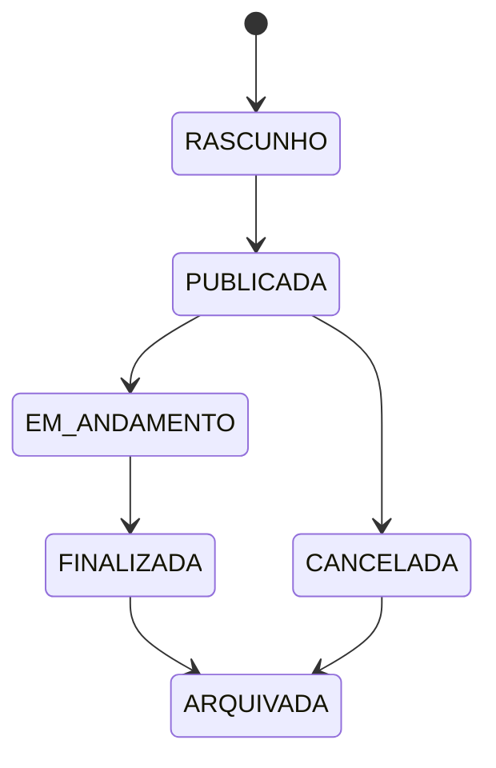
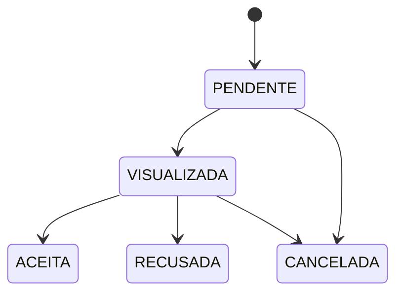
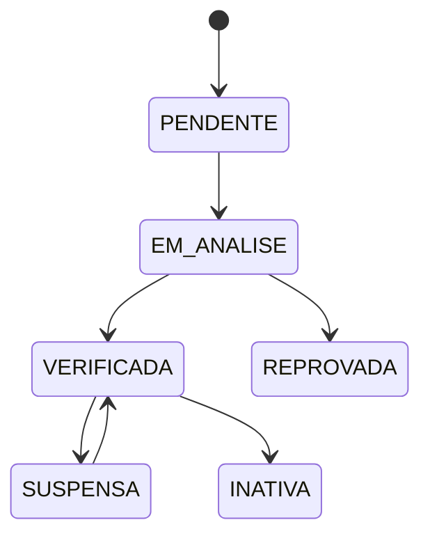
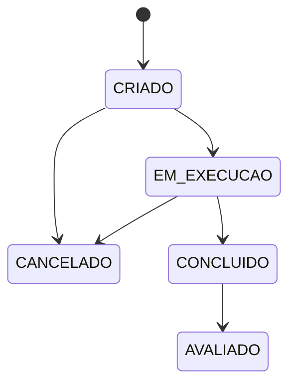

# OpenFree — State Machines v1.0

## Objetivo

Definir os estados principais das entidades da OpenFree e quais transições são permitidas.

---

## Vaga

### Estados

- RASCUNHO
- PUBLICADA
- EM_ANDAMENTO
- FINALIZADA
- CANCELADA
- ARQUIVADA

### Fluxo



---

## Candidatura

### Estados

- PENDENTE
- VISUALIZADA
- ACEITA
- RECUSADA
- CANCELADA

### Fluxo



---

## Empresa

### Estados

- PENDENTE
- EM_ANALISE
- VERIFICADA
- REPROVADA
- SUSPENSA
- INATIVA

### Fluxo



---

## Contrato

### Estados

- CRIADO
- EM_EXECUCAO
- CONCLUIDO
- CANCELADO
- AVALIADO

### Fluxo



---

## Regra geral

Nenhum status deve ser alterado diretamente sem passar por uma regra de negócio.

Exemplo errado:

```java
vaga.setStatus("FINALIZADA");
```

Exemplo correto:

```java
vagaService.finalizarVaga(id);
```
