# OpenFree — Casos de Uso v1.0

## Objetivo

Mapear as principais ações que usuários, empresas, freelancers e administradores podem executar dentro da OpenFree.

---

## Atores

### Visitante
Usuário ainda não autenticado.

### Freelancer
Profissional que busca oportunidades temporárias.

### Empresa
Organização que publica vagas e contrata freelancers.

### Administrador da Empresa
Usuário interno que gerencia vagas, candidatos e contratações.

### Owner da Empresa
Responsável principal pela empresa dentro da plataforma.

### Admin OpenFree
Equipe interna da OpenFree responsável por suporte, validação e moderação.

---

## Casos de Uso — Visitante

- Criar conta
- Fazer login
- Visualizar landing page
- Conhecer planos
- Recuperar senha

---

## Casos de Uso — Freelancer

- Completar perfil
- Editar perfil
- Buscar vagas
- Filtrar vagas
- Visualizar detalhes da vaga
- Candidatar-se a uma vaga
- Cancelar candidatura
- Visualizar histórico
- Avaliar empresa
- Visualizar avaliações recebidas

---

## Casos de Uso — Empresa

- Criar perfil da empresa
- Editar perfil da empresa
- Validar CNPJ
- Publicar vaga
- Editar vaga
- Cancelar vaga
- Visualizar candidatos
- Aceitar candidatura
- Recusar candidatura
- Finalizar contratação
- Avaliar freelancer
- Visualizar histórico de contratações

---

## Casos de Uso — Owner da Empresa

- Gerenciar dados da empresa
- Adicionar funcionário
- Remover funcionário
- Alterar permissões
- Gerenciar pagamentos
- Visualizar relatórios
- Suspender acesso interno

---

## Casos de Uso — Administrador da Empresa

- Criar vaga
- Editar vaga
- Visualizar candidatos
- Aceitar candidatura
- Recusar candidatura
- Finalizar contratação

---

## Casos de Uso — Admin OpenFree

- Validar empresas
- Suspender usuários
- Moderar avaliações
- Visualizar denúncias
- Acompanhar métricas da plataforma
- Gerenciar categorias

---

## Diagrama Mermaid

```mermaid
flowchart LR
    Visitante((Visitante))
    Freelancer((Freelancer))
    Empresa((Empresa))
    Owner((Owner Empresa))
    AdminEmpresa((Admin Empresa))
    AdminOpenFree((Admin OpenFree))

    CriarConta[Cria conta]
    Login[Faz login]
    RecuperarSenha[Recupera senha]

    CompletarPerfil[Completa perfil]
    BuscarVagas[Busca vagas]
    Candidatar[Candidata-se]
    CancelarCandidatura[Cancela candidatura]
    AvaliarEmpresa[Avalia empresa]

    CriarEmpresa[Cria perfil da empresa]
    ValidarCNPJ[Valida CNPJ]
    PublicarVaga[Publica vaga]
    EditarVaga[Edita vaga]
    CancelarVaga[Cancela vaga]
    VerCandidatos[Visualiza candidatos]
    AceitarCandidatura[Aceita candidatura]
    RecusarCandidatura[Recusa candidatura]
    FinalizarContratacao[Finaliza contratação]
    AvaliarFreelancer[Avalia freelancer]

    AdicionarFuncionario[Adiciona funcionário]
    RemoverFuncionario[Remove funcionário]
    AlterarPermissoes[Altera permissões]
    GerenciarPagamentos[Gerencia pagamentos]

    ValidarEmpresas[Valida empresas]
    SuspenderUsuarios[Suspende usuários]
    ModerarAvaliacoes[Modera avaliações]
    GerenciarCategorias[Gerencia categorias]

    Visitante --> CriarConta
    Visitante --> Login
    Visitante --> RecuperarSenha

    Freelancer --> CompletarPerfil
    Freelancer --> BuscarVagas
    Freelancer --> Candidatar
    Freelancer --> CancelarCandidatura
    Freelancer --> AvaliarEmpresa

    Empresa --> CriarEmpresa
    Empresa --> ValidarCNPJ
    Empresa --> PublicarVaga
    Empresa --> EditarVaga
    Empresa --> CancelarVaga
    Empresa --> VerCandidatos
    Empresa --> AceitarCandidatura
    Empresa --> RecusarCandidatura
    Empresa --> FinalizarContratacao
    Empresa --> AvaliarFreelancer

    Owner --> AdicionarFuncionario
    Owner --> RemoverFuncionario
    Owner --> AlterarPermissoes
    Owner --> GerenciarPagamentos

    AdminEmpresa --> PublicarVaga
    AdminEmpresa --> EditarVaga
    AdminEmpresa --> VerCandidatos
    AdminEmpresa --> AceitarCandidatura
    AdminEmpresa --> RecusarCandidatura

    AdminOpenFree --> ValidarEmpresas
    AdminOpenFree --> SuspenderUsuarios
    AdminOpenFree --> ModerarAvaliacoes
    AdminOpenFree --> GerenciarCategorias
```

---

## Casos de uso prioritários para o MVP

1. Criar conta
2. Fazer login
3. Criar perfil de empresa
4. Criar perfil de freelancer
5. Publicar vaga
6. Buscar vaga
7. Candidatar-se
8. Aceitar candidatura
9. Finalizar contratação
10. Avaliar usuário

---

## Fora do MVP

- Chat
- Pagamento pela plataforma
- OpenTrust completo
- IA
- Aplicativo mobile
- Programa de indicação
